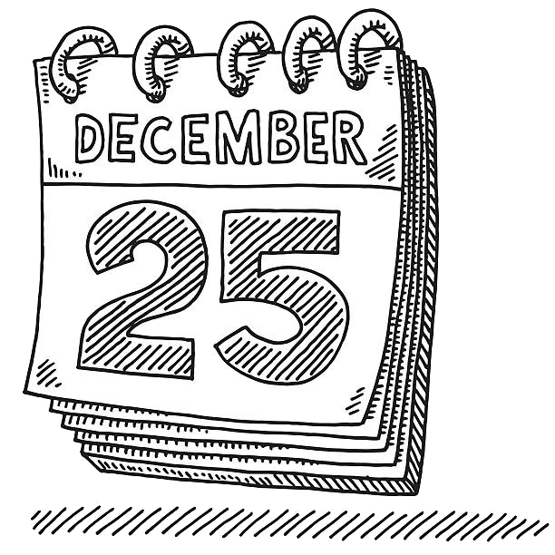

# :date: DÍA 5: Contando los días para los regalos

<table frame="box">
  <tr>
    <td>¡Qué ganas de abrir los regalos 🎁! Estoy tan nervioso que no paro de contar los días que faltan 🤣. ¿Me ayudas creando un programita? ¡Venga!</td>
    <td align="center"></td>
  </tr>
</table>

## Descripción del Reto