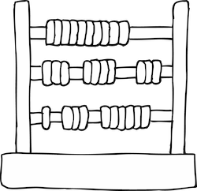

# :date: DÍA 6: Rematando los exámenes finales

<table frame="box">
  <tr>
    <td>Buffff! Ya huelo las vacaciones pero todavía falta terminar los exámenes finales. ¡Y toca un poco de matemáticas! 😱 ¡Ayúdame!</td>
    <td align="center"></td>
  </tr>
</table>

## Descripción del Reto