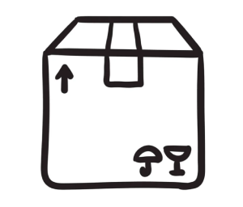

# :date: DÍA 9: Agrupando cosas automáticamente

<table frame="box">
  <tr>
    <td>Tenemos un montón de cajas en la fábrica de regalos... y como no automaticemos de alguna forma ordenar este desastre... ¡Igual nos quedamos sin Navidad!</td>
    <td align="center"></td>
  </tr>
</table>

## Descripción del Reto